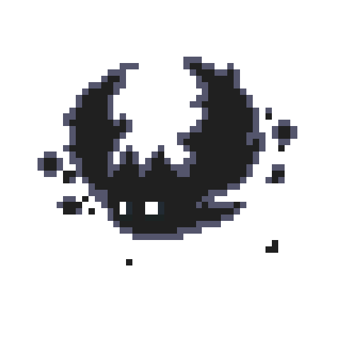

    

# 👋🏻 Hi, I'm Lars!

📍 **Aalst, Belgium**

 <em>Full-Stack developer (Web & Mobile) by day at </em> <a href="https://www.codifly.be/">Codifly</a> 

 <em>Creative developer by night </em>

I'm a Belgian software developer (working on web and mobile). I like building products that feel simple, fast and well crafted. Mostly working with React, React Native, Expo, TypeScript, Node.js, Bun, Turborepo, ...

## What I work with

## Connect

## Github Contributions

> [!IMPORTANT]
> Please note that my main work does not use Github. These contributions aren't added here.

